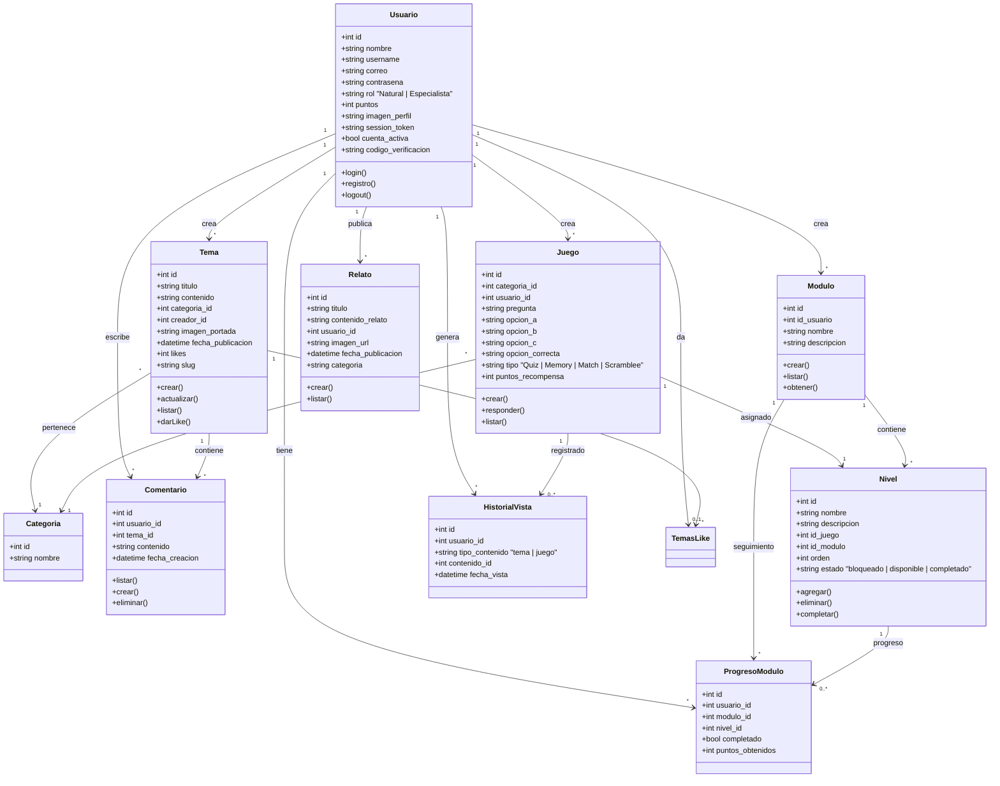

# Wind 2.0 — Plataforma de Patrimonio Cultural

Plataforma web para la difusión del patrimonio cultural de Coro, Venezuela. Incluye gestión de contenido histórico (temas, relatos), juegos patrimoniales (trivias, memoria, asociación, palabras), sistema de módulos con niveles, gamificación (puntos), y perfiles de usuario.

---

## Diagrama de Clases



---

## Arquitectura

```
app.js                    ← Punto de entrada
├── config/
│   ├── db.js             ← Pool de PostgreSQL
│   └── imagekit.js       ← Cliente ImageKit CDN
├── middlewares/
│   ├── autenticacion.js  ← verificarSesion, esEspecialista
│   └── subidaImagen.js   ← Multer + subirAImagekit()
├── controllers/          ← Lógica de negocio
│   ├── authController.js
│   ├── temaController.js
│   ├── juegoController.js
│   ├── moduloController.js
│   ├── comentarioController.js
│   ├── relatosController.js
│   ├── historialController.js
│   └── searchController.js
├── routes/               ← Definición de rutas HTTP
│   ├── authRoutes.js
│   ├── temaRoutes.js
│   ├── juegoRoutes.js
│   ├── moduloRoutes.js
│   ├── comentarioRoutes.js
│   ├── relatoRoutes.js
│   ├── searchRoutes.js
│   └── historialRoutes.js
├── views/                ← Plantillas HTML (21 páginas)
├── public/
│   ├── css/
│   ├── js/
│   └── uploads/
└── .env                  ← Variables de entorno
```

---

## Inicio Rápido

```bash
npm install
cp .env.example .env      # Configurar credenciales
npm run dev               # http://localhost:3000
```

## Stack

| Capa       | Tecnología               |
|------------|--------------------------|
| Backend    | Node.js + Express 5      |
| Base datos | PostgreSQL (Neon.tech)   |
| Frontend   | HTML + CSS + JS vanilla  |
| Templates  | Nunjucks                 |
| Sesiones   | express-session          |
| CDN        | ImageKit                 |
| Auth       | bcryptjs + sesión única  |

## Tipos de Juego

| Tipo       | Mecánica                            |
|------------|-------------------------------------|
| Quiz       | Pregunta con 3 opciones (A/B/C)     |
| Memory     | Encontrar pares de cartas           |
| Match      | Conectar concepto con su respuesta  |
| Scramblee  | Ordenar letras para formar palabra  |

## Roles

- **Natural** — Usuario registrado, puede jugar, comentar, escribir relatos
- **Especialista** — Puede crear temas, juegos, módulos y gestionar contenido
